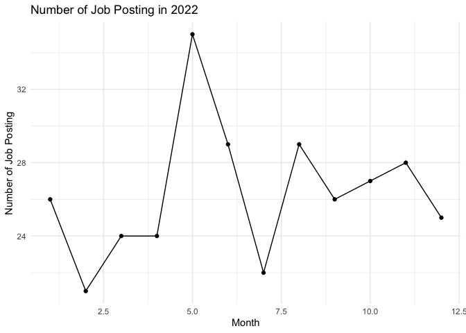

Job Searching Strategies
================

## Project Objective:

We will find out the best location to work after graduation, based on my
target locations and my background.

``` r
# Read in the original data
job<- arrow::read_feather('data/job_descriptions.feather')
library(tidyverse)
```

    ## ── Attaching core tidyverse packages ──────────────────────── tidyverse 2.0.0 ──
    ## ✔ dplyr     1.1.2     ✔ readr     2.1.4
    ## ✔ forcats   1.0.0     ✔ stringr   1.5.0
    ## ✔ ggplot2   3.4.3     ✔ tibble    3.2.1
    ## ✔ lubridate 1.9.2     ✔ tidyr     1.3.0
    ## ✔ purrr     1.0.2     
    ## ── Conflicts ────────────────────────────────────────── tidyverse_conflicts() ──
    ## ✖ dplyr::filter() masks stats::filter()
    ## ✖ dplyr::lag()    masks stats::lag()
    ## ℹ Use the conflicted package (<http://conflicted.r-lib.org/>) to force all conflicts to become errors

``` r
# set my target location to work
target_country <- c('USA','UK', 'China', 'Singapore', 'Macao SAR, China', 'Hong Kong SAR, China')
```

## Filter and clean data

The filter I used include: year; degree; location; job type; experience

``` r
# filter according to my job background
Job_clean <- job %>% 
  mutate(Job_year = year(`Job Posting Date`)) %>% 
  filter(Job_year == c(2022, 2023)
         , Qualifications != 'PhD'
         , Qualifications != 'MBA'
         , `Work Type` == 'Full-Time'
         , Country %in% target_country)

# filter working experience requirement
Job_clean <- Job_clean %>%
  mutate(sub = as.numeric(str_sub(Job_clean$Experience, 1, 1))) %>% 
  filter(sub == c(1, 0))
```

## Explore salary across target locations

Which country has the highest salary

``` r
# Which country has the highest salary
# clean salary data
Job_clean <- Job_clean %>% 
  mutate(min_salary = as.numeric(str_sub(Job_clean$`Salary Range`, 2, 3))
         , ncharmax = nchar(Job_clean$`Salary Range`)
         , max_salary = as.numeric(str_sub(Job_clean$`Salary Range`, 7, ncharmax - 1))
         , mean_salary = (min_salary + max_salary)/2)

# explore mean salary by country 
job_location <- Job_clean %>% 
  group_by(Country) %>% 
  summarise(mean_salary = mean(mean_salary)) %>% 
  arrange(desc(mean_salary))
job_location
```

    ## # A tibble: 6 × 2
    ##   Country              mean_salary
    ##   <chr>                      <dbl>
    ## 1 USA                         84.0
    ## 2 Macao SAR, China            83.0
    ## 3 Hong Kong SAR, China        82.9
    ## 4 China                       82.5
    ## 5 UK                          82.5
    ## 6 Singapore                   82.3

``` r
# The results seems to be wrong, due to a common currency in the original dataset.
```

\#let’s add currency into consideration

``` r
exchange_rate <- c(1, 1.21, 0.14, 0.73, 0.12, 0.13)
currency_data <- data.frame(Country = target_country,
                            rate = exchange_rate)

job_location <- merge(job_location, currency_data)

job_location$adjusted_salary <- job_location$mean_salary*job_location$rate

# Which country has the highest salary
job_location <- job_location %>% 
  arrange(desc(adjusted_salary))

job_location
```

    ##                Country mean_salary rate adjusted_salary
    ## 1                   UK    82.45652 1.21        99.77239
    ## 2                  USA    84.04217 1.00        84.04217
    ## 3            Singapore    82.28313 0.73        60.06669
    ## 4                China    82.48500 0.14        11.54790
    ## 5 Hong Kong SAR, China    82.89865 0.13        10.77682
    ## 6     Macao SAR, China    83.04667 0.12         9.96560

# what if we add purchasing power parity into consideration (PPP)

# PPP data was gained from OECD website, since there are only 6 data to collect, I just copied the data instead of merging a whole ppp data.

``` r
ppp <- c(1, 0.7, 4.18, 0.84, 5.87, 5.87)
ppp_data <- data.frame(Country = target_country,
                            ppp = ppp)
job_location <- merge(job_location, ppp_data)

job_location$ppp_salary <- job_location$adjusted_salary*job_location$ppp

# Which country has the highest salary after ppp
job_location <- job_location %>% 
  arrange(desc(ppp_salary))

job_location
```

    ##                Country mean_salary rate adjusted_salary  ppp ppp_salary
    ## 1                  USA    84.04217 1.00        84.04217 1.00   84.04217
    ## 2                   UK    82.45652 1.21        99.77239 0.70   69.84067
    ## 3 Hong Kong SAR, China    82.89865 0.13        10.77682 5.87   63.25996
    ## 4     Macao SAR, China    83.04667 0.12         9.96560 5.87   58.49807
    ## 5            Singapore    82.28313 0.73        60.06669 0.84   50.45602
    ## 6                China    82.48500 0.14        11.54790 4.18   48.27022

## Which country have more emphasize on ‘Data’

``` r
# Which country have more emphasize on 'Data'

library(stringr)
# count data
Job_clean$data_count <-  stringr::str_count(Job_clean$`Job Description`, '[Dd]ata') + 
  stringr::str_count(Job_clean$skills, '[Dd]ata')+
  stringr::str_count(Job_clean$Responsibilities, '[Dd]ata')
data <- Job_clean %>% 
  group_by(Country) %>% 
  summarise(data_count = sum(data_count)) %>% 
  arrange(desc(data_count))

data
```

    ## # A tibble: 6 × 2
    ##   Country              data_count
    ##   <chr>                     <int>
    ## 1 China                       122
    ## 2 Singapore                   103
    ## 3 USA                          93
    ## 4 UK                           90
    ## 5 Macao SAR, China             76
    ## 6 Hong Kong SAR, China         63

``` r
# The result shows China has the greatest concentration on 'data'.
```

## Which month has more opportunity of hiring?

``` r
# Which month has more opportunity of hiring?

library(ggplot2)

Job_number <- Job_clean %>% 
  filter(Job_year == 2022) %>% 
  mutate(month = month(`Job Posting Date`)) %>% 
  group_by(Job_year, month) %>% 
  summarise(number = n()) %>% 
  arrange(Job_year, month) %>% 
  mutate(date = paste(Job_year, month, sep = '-'))
```

    ## `summarise()` has grouped output by 'Job_year'. You can override using the
    ## `.groups` argument.

``` r
ggplot(Job_number, aes(month, number)) +
  geom_point()+
  theme_minimal()+
  geom_line()+
  labs(x = "Month", 
       y = "Number of Job Posting", 
       title = "Number of Job Posting in 2022")
```

<!-- -->
